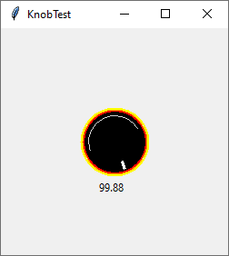

# TkKnob
The set of Tkinter widgets does not contain a knob widget like you might imagine it on a analog (or digital) sound system.

## Install
### Create a conda environment
```bash
conda init bash # => Open new terminal
conda create --name tk_knob python=3.8
conda install --name tk_knob tk
```

### Activate the conda environment and start the program
```bash
cd tk_knob/
conda activate tk_knob
./main.py
```

## Here are some screenshots on what is possible

